---

---

来大学也有一年的时间，每个人都是抱着满心期盼来到大学的。但是这些期盼会被慢慢消磨掉。

既然已经有一年时间了，便抽个空做个小结和数据分析好了。

## 效率

关于效率，我将在下面放出一些数据图来做对比。

然后还要说的就是一些生活琐事对效率的巨大影响。

1. 首先就是吃饭，在家里吃饭顶多30分钟一餐，但在学校最少是1小时，这个巨大的差别是因为去食堂要花时间，排队要花时间。经常下课食堂就爆满。
2. 然后是洗衣服，在家里可以让家长洗衣服而且有全自动洗衣机。来了没独卫的大学才知道全自动洗衣机是多么伟大的发明，可惜我用不了。每周我得花费大约将近10小时洗衣服。其实每层宿舍有2个公共洗衣机，但是偶然瞥见别人洗的东西，不敢用了。
3. 接着是锻炼，在家里我有很大的空间，并且有自己安排好的时间去锻炼，但在学校不行，在学校甚至跑步还要看天气，有雾霾就跑不得，毕竟锻炼的目的就是为了锻炼身体，雾霾跑步无异于自残。而在家那边几乎碰不到雾霾天气。
4. 顺带提一嘴领快递，家里快递送上门是一件非常幸福的事情，学校需要去拿，不过也不算麻烦。
5. 最后还有看书，在寝室别想看书。虽然我把看书时间安排在深夜别人都睡了，但也只挤出来了一点点时间。或许我该试着习惯去图书馆。不过去图书馆也需要花费行程时间。

### 锻炼效率数据图

| 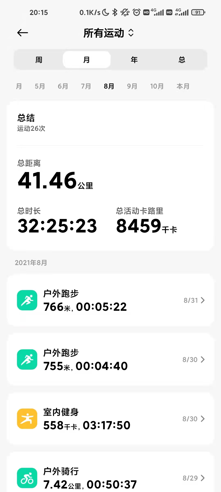 | 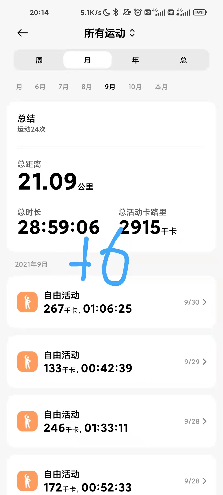 | 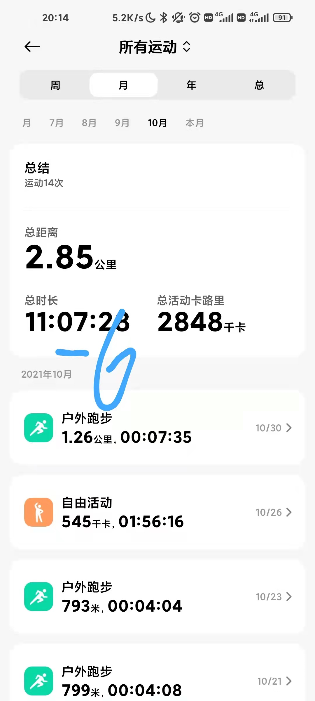 |
| ------------------------------------------------------------ | ------------------------------------------------------------ | ------------------------------------------------------------ |
| 8月在家的锻炼时间                                            | 9月在家的锻炼时间                                            | 10号返校后，10月份在学校的锻炼时间                           |

### 读书效率数据图

| 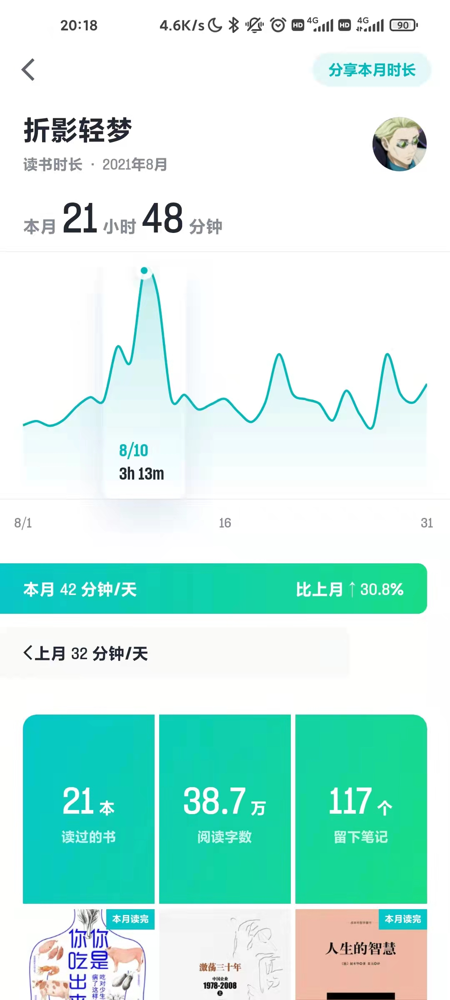 | 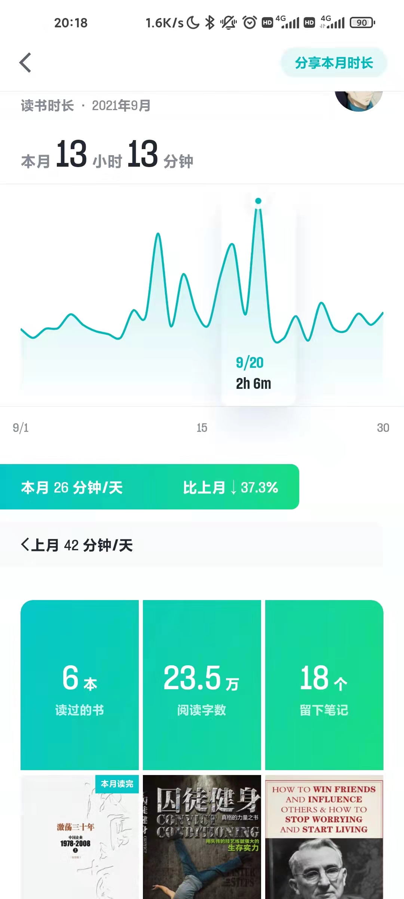 | 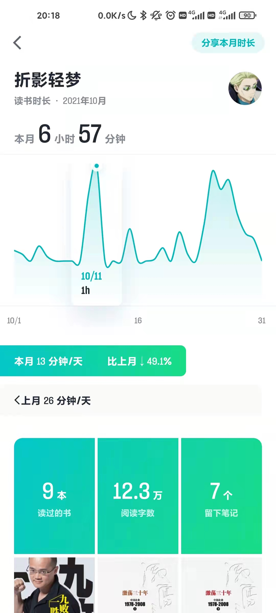 |
| ------------------------------------------------------------ | ------------------------------------------------------------ | ------------------------------------------------------------ |
| 8月阅读时间                                                  | 9月阅读时间，还有大量阅读纸质书的时间没统计                  | 来学校后，没读纸质书（一些时长还是晚上睡不着听书弄的         |

### 项目肝量

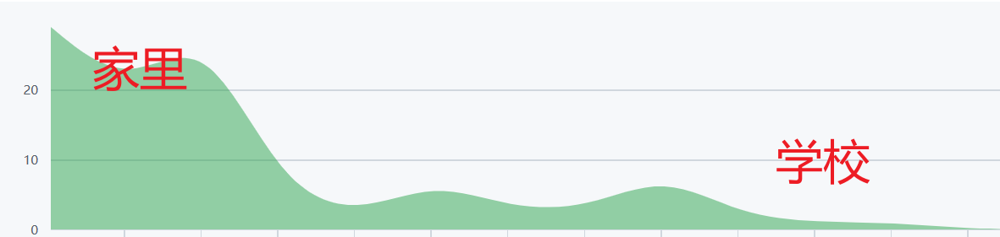

## 睡眠质量

睡眠质量在学校是大幅下降的。看数据，在家和在学校其实差不多。但是为什么说在学校的睡眠质量大幅度下降呢，主要是因为在学校多了个午休。而午休是地效睡眠，绝对不如把午休的时间放到晚上去睡觉的。而我在家里是基本不午休的。

| 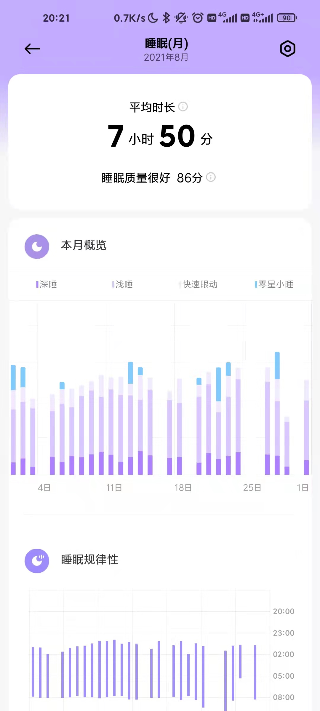 | 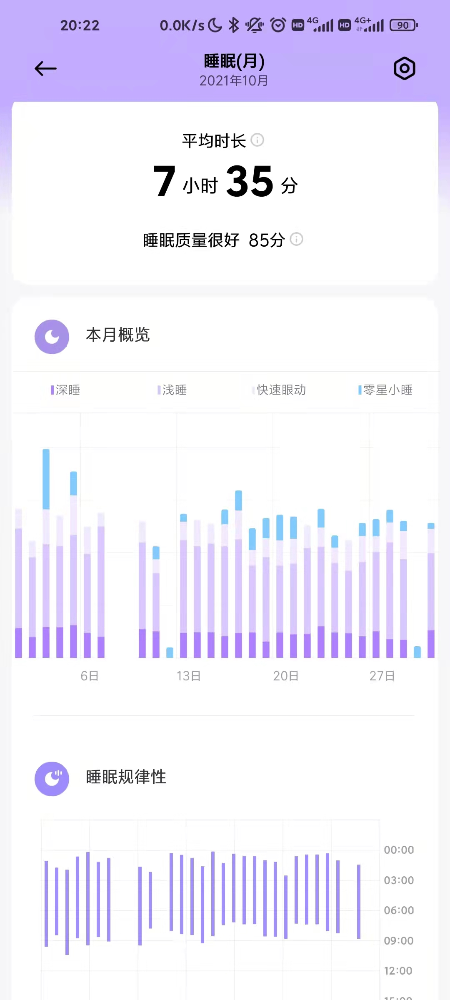 |
| ------------------------------------------------------------ | ------------------------------------------------------------ |
| 也不知道这零星小睡啥意思                                     | 其实对比两图可以看出来我在家睡的比学校更早，在家起床也比较规律 |

## 生活上的区别

1. 在学校食堂选择挺多，一个星期每餐都不一样，就是肉不够吃。
2. 在学校，跑道离宿舍近，在家跑步还得骑车去跑道。
3. 公共厕所真是精神污染，不知道宿管多久清理一次，至今为止还没摸清规律。
4. 桌子太小了，我在我房间整了三个桌子，一个放电脑，一个放杂物工具，一个做化学药品（杀虫剂）调配。
5. 提到杀虫剂，顺便提一下，由于环境恶劣，宿舍蚊虫比家里少很多。
6. 说到环境，学校的气候太干燥而且大部分时间里都有雾霾。
7. 独处时间太少，我太怀念家里能一个人在房间里发疯的日子了。

## 学习

来学校过后编程的学习时间断崖式下跌。在学校根本不可能达成早上一起来就一直撸代码撸到晚上睡觉这种状态。然后还得上被安排的课，一些对我未来的职业没有意义的课。这使我在计算机投入的时间大幅度减少了。

### 8月的某个星期创造的奇迹

这29小时理论来说是净代码时间，只在使用编辑器，只在敲键盘时统计。

可能我那个星期每天都有十几个小时坐电脑面前。

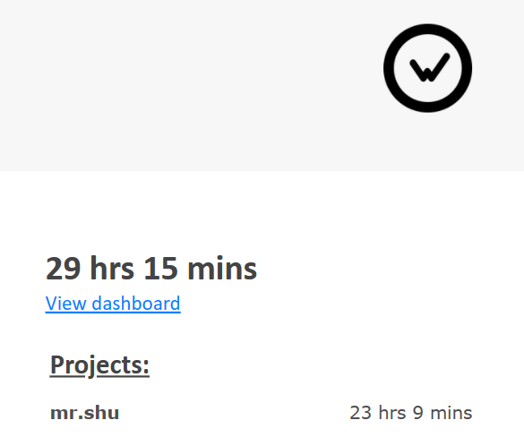

### 背单词

单词还是继续背

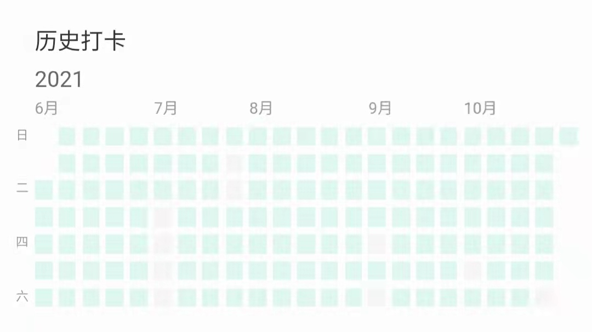

### 英语听力精听

在家听力圈起来的那些的一部分大概有二十多篇（9月份开始听的，基本就是每天一篇，偶尔摸摸鱼），来学校目前为止听了三篇听力

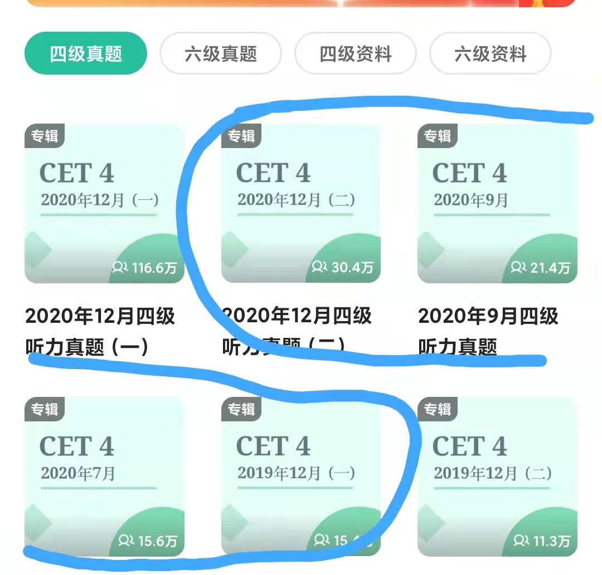

